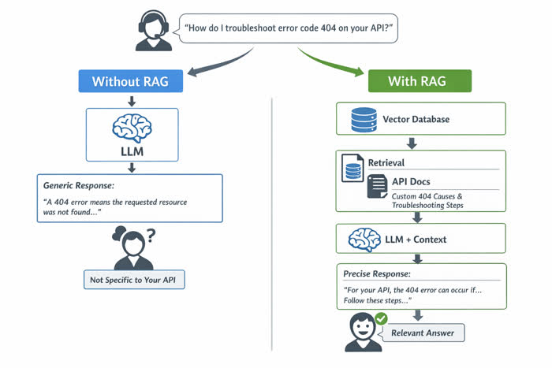

# Understanding Large Language Models

Large Language Models (LLMs) have revolutionized our interaction with artificial intelligence, moving beyond simple question-answering systems to become powerful reasoning engines capable of complex, multi-step problem solving. This shift is particularly evident in the burgeoning field of agentic programming, where software systems transition from executing rigid, pre-defined scripts to becoming autonomous entities. These agents leverage LLMs as their "brain," enabling them to understand high-level goals, break them down, and interact with the world to achieve objectives that would traditionally require human intervention. This module explores the foundational architecture and key capabilities of LLMs that make them uniquely suited for these sophisticated agentic tasks.

## The Agentic Paradigm: LLMs as Reasoning Engines

At the heart of agentic programming lies a continuous, iterative cycle where an LLM-powered agent strives to achieve a given goal. Unlike traditional programs that follow a strict sequence, agents are dynamic, adapting their approach based on real-time feedback.

### The Plan-Action-Observation Loop

This fundamental cycle defines how an agent operates:

1.  **Planning**: The LLM, given a high-level goal, first attempts to understand the task and decompose it into smaller, manageable sub-tasks or a sequence of steps. This involves strategic thinking, identifying necessary information, and determining which tools might be useful.
2.  **Action**: Based on its plan, the LLM decides to perform an action. This action typically involves using external tools (e.g., search engines, code interpreters, databases, APIs) by generating specific inputs that these tools understand. The interaction with these tools is facilitated by a **Model Context Protocol**, which standardizes how the LLM describes its intent and how tool outputs are presented back to the model.
3.  **Observation**: After executing an action, the agent receives an observation – the result or output from the tool. The LLM then evaluates this observation against its current plan and overall goal. This evaluation might lead to refining the plan, performing another action, or concluding the task if the goal is met.

This loop allows agents to be self-correcting, learning from their interactions and adjusting their behavior until the objective is achieved.

### Model Context Protocol and Tool Use

For an LLM to effectively act in the world, it needs to interact with external systems. The Model Context Protocol is a crucial abstraction layer that enables this. It defines a standardized way for the LLM to understand what tools are available, what their functions are, and what arguments they expect. When the LLLLM decides to use a tool, it generates structured output (often JSON) that conforms to this protocol, which is then parsed by the agent framework and used to invoke the actual tool. The tool's output is then formatted back into the LLM's context, allowing it to "observe" the results.

**Example: A Research Agent**
Imagine an agent tasked with "Find the current stock price of Google and summarize recent news."

*   **Plan**:
    1.  Find Google's stock ticker.
    2.  Use a stock price tool with the ticker.
    3.  Use a news search tool for "Google" and "recent news."
    4.  Synthesize the information.
*   **Action (Step 1)**: The LLM might use a "company_lookup" tool.
    *   *LLM Output (conceptual)*: `{"tool": "company_lookup", "args": {"company_name": "Google"}}`
*   **Observation (Step 1)**: The tool returns "GOOG" and "GOOGL". The LLM picks one.
*   **Action (Step 2)**: The LLM uses a "stock_price" tool.
    *   *LLM Output (conceptual)*: `{"tool": "stock_price", "args": {"ticker": "GOOG"}}`
*   **Observation (Step 2)**: The tool returns `{"ticker": "GOOG", "price": 175.20}`.
*   **Action (Step 3)**: The LLM uses a "news_search" tool.
    *   *LLM Output (conceptual)*: `{"tool": "news_search", "args": {"query": "Google recent news"}}`
*   **Observation (Step 3)**: The tool returns several news headlines and snippets.
*   **Action (Step 4)**: The LLM synthesizes all observations into a final summary.

## Guiding LLM Logic: Prompt Engineering for Agents

The way we communicate with an LLM significantly impacts its performance, especially in agentic contexts. Prompt Engineering techniques are vital for guiding the LLM's reasoning and action selection.

### Chain-of-Thought (CoT) Prompting

Chain-of-Thought prompting encourages the LLM to articulate its reasoning process step-by-step before arriving at a final answer or action. This often involves providing examples where the thinking process is explicitly shown. CoT improves the model's ability to tackle complex problems by forcing it to break down the task internally, making its reasoning more transparent and often more accurate.

**Example: CoT for a Math Problem**
*   **Prompt**: "Solve the following problem. Explain your reasoning step by step. If a car travels at 60 mph for 2 hours, how far does it travel?"
*   **LLM's CoT Response**:
    *   *Thought*: The problem asks for the distance traveled.
    *   *Thought*: I know the formula for distance is speed multiplied by time (Distance = Speed × Time).
    *   *Thought*: The speed is given as 60 mph.
    *   *Thought*: The time is given as 2 hours.
    *   *Thought*: So, Distance = 60 mph × 2 hours.
    *   *Thought*: Calculating this, 60 × 2 = 120.
    *   *Answer*: The car travels 120 miles.

### ReAct (Reasoning and Acting) Prompting

ReAct combines the explicit reasoning of Chain-of-Thought with the ability to perform actions using tools. It structures the prompt to elicit a sequence of `Thought`, `Action`, and `Observation` steps from the LLM, mirroring the agentic loop itself.

*   **Thought**: The LLM states its internal reasoning, planning the next step.
*   **Action**: The LLM specifies which tool to use and with what parameters.
*   **Observation**: The LLM receives and processes the output from the tool.

This cycle continues until the task is complete. ReAct is particularly powerful for complex tasks requiring interaction with external environments, as it allows the LLM to dynamically adapt its plan based on real-world feedback.

**Example: ReAct for a Travel Agent**
*   **Goal**: Find a direct flight from New York to London for next Friday.

*   **LLM (Initial Prompt)**: "You are a travel agent. Your goal is to find a direct flight from New York to London for next Friday. Use the `flight_search` tool."
    *   **Thought**: I need to find flights. The user specified "next Friday". I need to determine the exact date for "next Friday" first. I will use a `date_calculator` tool.
    *   **Action**: `date_calculator(input="next Friday")`
    *   **Observation**: `{"date": "2024-10-25"}` (Assuming today is Oct 18, 2024)
    *   **Thought**: Now I have the exact date. I can use the `flight_search` tool to find direct flights from New York (NYC) to London (LHR/LGW).
    *   **Action**: `flight_search(origin="NYC", destination="LON", date="2024-10-25", direct_only=True)`
    *   **Observation**: `{"flights": [{"flight_number": "BA174", "departure_time": "18:00", "arrival_time": "06:00", "airline": "British Airways"}, {"flight_number": "VS003", "departure_time": "20:00", "arrival_time": "08:00", "airline": "Virgin Atlantic"}]}`
    *   **Thought**: I have found direct flights. I should present these options to the user.
    *   **Answer**: "I found two direct flights from New York to London for next Friday, October 25th: British Airways flight BA174 departing at 6 PM, and Virgin Atlantic flight VS003 departing at 8 PM."

## Enhancing LLM Knowledge: Retrieval-Augmented Generation (RAG)

While LLMs are vast repositories of knowledge, their understanding is limited to the data they were trained on. For agentic tasks, particularly those requiring current, specific, or proprietary information, LLMs need access to external knowledge bases. This is where Retrieval-Augmented Generation (RAG) becomes indispensable.

### The Need for External Knowledge and Long-Term Memory

LLMs face several limitations without external augmentation:

*   **Knowledge Cut-off**: Their training data is not continuously updated, meaning they lack information about recent events or developments.
*   **Hallucinations**: Without factual grounding, LLMs can confidently generate incorrect or nonsensical information.
*   **Specificity**: They cannot access specific details from private documents, databases, or real-time data sources.
*   **Long-Term Memory**: While they have a context window, this is short-term memory. Agents often need to recall information from previous interactions or retrieve knowledge from vast, persistent stores.

RAG addresses these issues by providing a mechanism for the LLM to dynamically access and incorporate external, up-to-date, and relevant information into its generation process.

### How RAG Works

RAG typically involves two main stages:

1.  **Retrieval**: When an LLM needs external information (e.g., to answer a question, perform a task), a retriever component searches a vast knowledge base (e.g., a vector database of documents, a company's internal wiki) for relevant snippets or documents. This search is often based on semantic similarity between the user's query/LLM's thought and the content in the knowledge base.
2.  **Generation**: The retrieved relevant information is then added to the LLM's context window, along with the original prompt. The LLM then uses this augmented context to generate a more informed, accurate, and grounded response or to guide its next action.

**Example: RAG for a Technical Support Agent**

A technical support agent powered by an LLM receives a query: "How do I troubleshoot error code 404 on your API?"

*   **Without RAG**: The LLM might give a generic explanation of HTTP 404 errors, which might not be specific to *your* API.
*   **With RAG**:
    *   **Retrieval**: The query "troubleshoot error code 404 on your API" is used to search a vector database containing your company's API documentation.
    *   **Retrieved Content**: The retriever finds a section detailing common 404 causes for your API, specific endpoints that might return it, and troubleshooting steps unique to your platform.
    *   **Generation**: The LLM receives the original query *plus* the retrieved documentation snippets. It then generates a precise answer, referencing your specific API documentation and providing relevant, actionable troubleshooting steps.

## Orchestration: Building Self-Correcting Workflows

Building sophisticated agentic systems requires more than just individual LLMs and tools; it demands orchestration. Frameworks like LangGraph, CrewAI, and AutoGen provide the scaffolding to design, manage, and execute complex multi-agent workflows.

These frameworks enable:

*   **Multi-Agent Collaboration**: Different LLMs can be assigned specialized roles (e.g., a "Researcher Agent," a "Code Executor Agent," a "Summarizer Agent") that collaborate to achieve a larger goal.
*   **State Management**: They track the progress of the agentic loop, maintaining context, previous observations, and the current plan.
*   **Conditional Logic**: Agents can be programmed to follow different paths based on observations (e.g., "If tool A fails, try tool B; otherwise, proceed to step C").
*   **Human-in-the-Loop**: Integration points allow human oversight, correction, or approval at critical junctures.
*   **Self-Correction and Refinement**: By orchestrating the Plan-Action-Observation loop, these frameworks facilitate iterative refinement. An agent can identify errors in its own output or plan, use tools to correct them (e.g., a code interpreter to fix buggy code), and continue until the objective is met with high quality.

This orchestration is what transforms a simple LLM prompt into a robust, autonomous system capable of tackling real-world problems.

## Common Challenges and Solutions in Agentic LLMs

While incredibly powerful, developing and deploying agentic LLMs comes with its own set of challenges. Understanding these and knowing potential solutions is crucial for effective implementation.

### Challenges

*   **Hallucinations and Factual Accuracy**: LLMs can generate plausible but incorrect information, especially when lacking specific data or operating outside their training distribution.
*   **Cost and Latency**: Repeated calls to powerful LLMs and external tools can be expensive and slow, impacting user experience and operational budgets.
*   **Tool Integration Complexity**: Connecting LLMs to a diverse set of tools (APIs, databases, custom functions) requires careful design of the Model Context Protocol and robust error handling.
*   **Prompt Sensitivity**: The performance of an agent can be highly sensitive to subtle changes in prompts, making iteration and debugging challenging.
*   **Evaluation and Reliability**: Quantifying the success of an agentic system, especially for open-ended tasks, is difficult. Ensuring reliability and consistent performance across varied inputs is a major hurdle.
*   **Context Window Limitations**: Even with large context windows, there's a limit to how much information an LLM can process at once, which can hinder complex, long-running tasks.
*   **Safety and Bias**: Agents can inherit biases from their training data or misuse tools in unintended ways, leading to harmful or unfair outcomes.

### Solutions

*   **Robust RAG Implementation**: Prioritize high-quality retrieval systems. Implement multiple retrieval strategies (e.g., semantic search, keyword search), re-ranking, and careful chunking of documents to ensure the most relevant and accurate information is always provided to the LLM.
*   **Caching and Parallelization**: Implement caching for frequently accessed tool calls or LLM responses. For multi-step tasks, explore parallel execution of independent sub-tasks where possible to reduce overall latency.
*   **Standardized Tool Interfaces**: Design clear, consistent, and well-documented tool APIs and schema for the Model Context Protocol. Use Pydantic or similar libraries for strong type checking and validation of tool inputs/outputs. Implement comprehensive error handling and retry mechanisms.
*   **Systematic Prompt Testing and Versioning**: Treat prompts as code. Implement version control for prompts, A/B test different prompting strategies, and use automated evaluation metrics where possible. Few-shot examples and self-correction prompts can also make models more robust.
*   **Human-in-the-Loop (HITL)**: Integrate human oversight at critical decision points. This allows for validation, correction, and continuous learning. For complex tasks, consider breaking them down into sub-tasks where humans can review intermediate steps.
*   **Context Management Strategies**: Employ summarization techniques to condense past interactions or observations before feeding them back into the LLM's context. Implement memory systems that store key information in a structured way, retrieving it only when relevant.
*   **Guardrails and Ethical AI Practices**: Implement content moderation filters, safety checks on tool outputs, and pre-defined rules to prevent misuse. Regularly audit agent behavior for bias and ensure transparency in its decision-making process.

## Engaging with the Material

Understanding LLMs in the context of agentic programming is best achieved through hands-on experimentation. We encourage you to:

*   **Experiment with different prompts**: Try varying the instructions, adding Chain-of-Thought examples, or structuring your prompts using the ReAct pattern. Observe how these changes affect the LLM's output and behavior.
*   **Think about tool design**: Consider what tools an LLM agent would need for a specific task. How would you define their functions and expected inputs/outputs?
*   **Explore RAG**: Think about scenarios where an LLM would benefit from external knowledge. How would you structure that knowledge base for effective retrieval?
*   **Consider ethical implications**: As you design agents, reflect on potential biases, misuse, or unintended consequences. How can you build safeguards into your systems?

## Summary

Large Language Models are transforming software development by enabling the creation of autonomous, goal-driven agents. This paradigm shift is underpinned by the **Plan-Action-Observation loop**, where LLMs act as sophisticated **reasoning engines** that leverage a **Model Context Protocol** to interact with external **tools**. Key **prompt engineering** techniques like **Chain-of-Thought** and **ReAct** are crucial for guiding the LLM's internal logic and external actions. Furthermore, **Retrieval-Augmented Generation (RAG)** provides agents with access to dynamic, external, and up-to-date information, mitigating knowledge cut-off and hallucination issues. By orchestrating these components through frameworks like LangGraph or CrewAI, developers can build complex, self-correcting workflows where specialized agents collaborate and refine their outputs to achieve high-level objectives. While challenges such as cost, latency, and reliability exist, strategic solutions involving robust RAG, careful tool design, and systematic prompt engineering pave the way for increasingly capable and intelligent agentic systems.

## Further Reading and Resources

*   **ReAct Paper**: "ReAct: Synergizing Reasoning and Acting in Language Models" by Yao et al. (2022) - [https://arxiv.org/abs/2210.03629](https://arxiv.org/abs/2210.03629)
*   **Chain-of-Thought Prompting**: "Chain-of-Thought Prompting Elicits Reasoning in Large Language Models" by Wei et al. (2022) - [https://arxiv.org/abs/2201.11903](https://arxiv.org/abs/2201.11903)
*   **Retrieval-Augmented Generation**: "Retrieval-Augmented Generation for Knowledge-Intensive NLP Tasks" by Lewis et al. (2020) - [https://arxiv.org/abs/2005.11401](https://arxiv.org/abs/2005.11401)
*   **LangChain Documentation**: A popular framework for building LLM applications, including agents and RAG. - [https://www.langchain.com/](https://www.langchain.com/)
*   **CrewAI Documentation**: A framework for orchestrating role-playing autonomous AI agents. - [https://www.crewai.com/](https://www.crewai.com/)
*   **LlamaIndex Documentation**: A data framework for LLM applications, focusing on RAG. - [https://www.llamaindex.ai/](https://www.llamaindex.ai/)