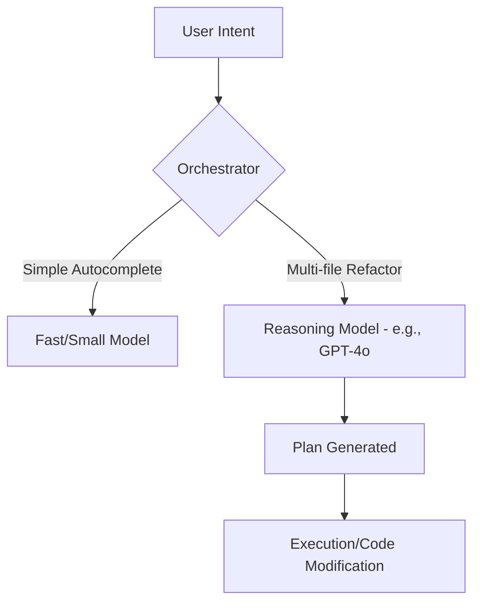
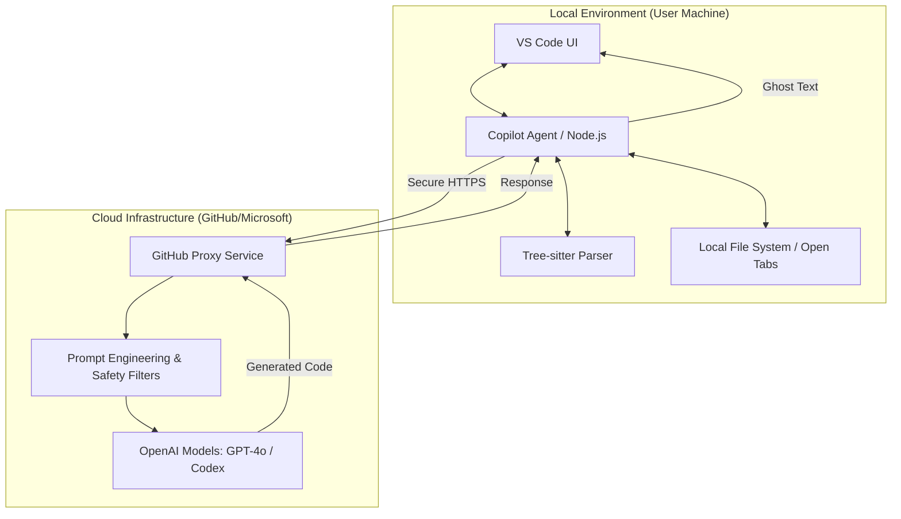

# Use Cases and Applications

The transition from traditional software to agentic systems marks a shift from tools that wait for instructions to partners that anticipate needs and execute complex workflows. While the theoretical foundations of Planning, Acting, and Observing are essential, the true power of agentic programming is revealed through its application. By integrating Large Language Models (LLMs) with tool-access and iterative reasoning, we can solve problems that were previously too dynamic or unstructured for standard code.

In this section, we explore how agentic paradigms are being deployed across industries, with a specific deep dive into the architecture of one of the most successful agentic tools to date: GitHub Copilot within VSCode.

## The Spectrum of Agentic Applications

Agentic programming excels in environments characterized by high variability and the need for multi-step reasoning. Unlike a script that follows a linear path, an agent can pivot based on the data it encounters.

### Autonomous Research and Data Synthesis
In traditional research, a human must manually search, read, and summarize information. An agentic system, however, can be given a high-level goal, such as "Analyze the impact of recent interest rate changes on the tech sector." The agent plans its search queries, uses a web-search tool to gather articles, reads them to find relevant data points, and then synthesizes a report. If it finds conflicting information, it can "observe" the discrepancy and perform a follow-up "action" to verify the facts.

### Dynamic Customer Support
Modern customer service agents go beyond simple chatbots. An agentic support system can access a user’s account history, consult internal documentation via Retrieval-Augmented Generation (RAG), and execute actions like processing a refund or resetting a password. Because the system operates in a loop, it can ask clarifying questions to the user if the initial goal is ambiguous, mimicking the problem-solving behavior of a human representative.

### Automated DevOps and System Administration
Agentic systems are increasingly used to manage complex cloud infrastructures. An agent can monitor system logs for errors. Upon detecting a failure, it doesn't just alert a human; it begins an investigation. It might run diagnostic commands, check recent code deployments, and propose (or even apply) a patch in a staging environment to see if the error persists before reporting its findings to the engineering team.

## Deep Dive: VSCode Copilot Architecture

GitHub Copilot, particularly within the VSCode environment, serves as a premier example of agentic programming in the wild. It has evolved from a simple "autocomplete" tool into a sophisticated agentic assistant capable of understanding entire codebases and executing complex refactoring tasks.

### The Agentic Workflow of Copilot
When you interact with Copilot—whether through inline suggestions or the Chat interface—the system follows an architecture designed to maximize context and accuracy.

*   **Context Gathering (The Observation Phase):** Copilot does not just look at the line you are typing. It acts as an observer of your entire workspace. It analyzes open tabs, related files, and even your project structure. This "Retrieval" step ensures the LLM has the necessary local knowledge to provide relevant code.
*   **Prompt Construction (The Planning Phase):** The system takes your current cursor position and the gathered context to build a complex prompt. This isn't just a simple query; it includes system instructions that tell the model to act as a world-class engineer, adhering to specific coding standards and styles.
*   **The LLM Reasoning Engine:** The constructed prompt is sent to a powerful backend model (such as GPT-4o or specialized Claude models). The model doesn't just predict the next word; it reasons through the logic of the code you are trying to write.
*   **Action and Feedback:** In features like "Copilot Edits," the agent proposes changes across multiple files. The user acts as the "environment" in the loop, providing feedback by accepting, rejecting, or modifying the code. The agent then observes these choices to refine future suggestions.

### Architectural Components
1.  **The Client (VSCode Extension):** Manages the UI and monitors user activity. It is responsible for "scraping" the relevant context from the editor.
2.  **The Proxy Server:** Acts as a gateway that handles authentication, telemetry, and security filtering (ensuring no sensitive data or toxic content is processed).
3.  **The Model Context Protocol (MCP):** While Copilot uses proprietary methods, many modern agents use protocols like MCP to allow the LLM to "talk" to the file system, terminal, and external APIs securely.
4.  **The Reasoning Model:** The core LLM that processes the context and generates the agentic response.

### Execution
GitHub Copilot uses separate models for "planning" versus "execution" in every interaction, it highlights an architecture designed for **multi-model flexibility**. 

According to the **Common Challenges and Solutions** section, agentic systems often optimize performance by splitting tasks:

*   **Triage/Observation:** Smaller, faster models can be used for simple context gathering or error checking to reduce latency and cost.
*   **Complex Planning:** Larger models (like **GPT-4o** or **Claude 3.5 Sonnet**) are reserved for high-level reasoning, such as when you use "Copilot Edits" to refactor code across multiple files.

### Conceptual Model Routing
In a sophisticated agentic stack like Copilot’s, the "Orchestrator" acts as a router:



This "tiered" approach allows the system to be responsive for typing while remaining powerful for complex architectural changes. Does this distinction between a fast "prediction" and a slower "plan" change how you think about the AI's "intelligence"?

## The GitHub Copilot Stack: Architecture and Origins

GitHub Copilot is often cited as the first mass-market "AI Agent" for developers. Unlike a simple chatbot, Copilot functions as an agentic system because it autonomously perceives its environment (the IDE), reasons about the developer's intent through context, and acts by generating or modifying code. To understand how this works, we must look under the hood at the "Copilot Stack"—a sophisticated blend of in-house orchestration and external model power.

### The Multi-Layered Architecture

The Copilot stack is not a monolithic application; it is a distributed system consisting of three primary layers: the **Client Extension**, the **Local Agent**, and the **Remote Orchestration Service**.

1.  **The Client Extension (VS Code):** Developed in-house by GitHub/Microsoft, this is the user-facing layer. It handles UI elements like ghost text (inline suggestions) and the chat panel.
2.  **The Copilot Agent:** This is a local Node.js executable bundled with the extension. It acts as the "brain" on the user's machine. It implements the Language Server Protocol (LSP) to communicate with the IDE and manages the complex logic of context extraction.
3.  **The GitHub Proxy & Orchestrator:** When a request is sent to the cloud, it doesn't go straight to an LLM. It hits GitHub’s backend (built in-house), which handles telemetry, abuse prevention, and prompt "augmentation" before hitting the inference engine.

### Context Construction and Tree-sitter

The "magic" of Copilot lies in its ability to understand files you haven't even mentioned. It uses an open-source library called **Tree-sitter** (originally developed at GitHub) to create concrete syntax trees of your code. This allows the agent to perform "Neighboring Tab" analysis. 

If you are writing a React component, the agentic logic scans other open tabs for related types or CSS classes to include in the prompt. This process—gathering local context to create a "prompt craft"—is the most critical in-house technology GitHub developed for the stack.



### The Model Layer: OpenAI Partnership

While the IDE integration and context-gathering logic were developed in-house by GitHub, the core reasoning engine—the Large Language Model (LLM)—is provided by **OpenAI**. 

*   **Codex:** Originally, Copilot was powered by Codex, a descendant of GPT-3 fine-tuned specifically on public GitHub code.
*   **GPT-4 / GPT-4o:** Modern iterations of Copilot utilize OpenAI's flagship models, allowing for better architectural reasoning and conversational abilities in Copilot Chat.

### Example: How an Agentic Request is Formed

When you type a function signature, the Copilot Agent doesn't just send that line to the LLM. It constructs a payload that looks similar to this conceptual structure:

```json
{
  "prefix": "function calculateTotal(items) {",
  "suffix": "}",
  "context": [
    {
      "file": "types.ts",
      "content": "interface Item { price: number; quantity: number; }"
    },
    {
      "file": "cart.ts",
      "content": "import { calculateTotal } from './utils';"
    }
  ],
  "extra": "User is using TypeScript and Vitest for testing."
}
```

This "Agentic Context" ensures the generated code isn't just syntactically correct, but also relevant to the specific project structure.

```masteryls
{"id":"0b513fd3-7646-4d74-b258-5f778ff465b0", "title":"The Role of the Copilot Agent", "type":"multiple-choice"}
What is the primary responsibility of the "Copilot Agent" (the local Node.js process) within the stack?

- [ ] It hosts the LLM locally so that code never leaves the user's machine.
- [x] It manages local context extraction, such as scanning neighboring tabs and using Tree-sitter.
- [ ] It is responsible for billing and checking the user's GitHub Pro subscription status.
- [ ] It provides the graphical user interface elements for the VS Code sidebar.
```


## Common Challenges and Solutions

Implementing agentic systems is not without its hurdles. Transitioning from a controlled script to an autonomous agent introduces non-determinism and potential for error.

*   **The Challenge of "Infinite Loops":** An agent might get stuck in a loop where it tries the same failing action repeatedly.
    *   *Solution:* Implement "Max Iteration" caps and "Self-Reflection" prompts. Force the agent to explain why its previous attempt failed before it tries a new approach.
*   **Latency and Cost:** Every step in an agentic loop (Plan -> Act -> Observe) requires an LLM call, which can be slow and expensive.
    *   *Solution:* Use smaller, faster models for simple "observation" or "triage" tasks, and reserve larger, expensive models for complex "planning" stages.
*   **Hallucinated Tool Use:** An agent might try to use a tool or a function that doesn't exist.
    *   *Solution:* Provide the agent with a strict schema of available tools (often using JSON) and implement robust error handling that feeds the error message back to the agent so it can correct its mistake.

## Engagement: Thinking Like an Agent Architect

Consider a task you perform daily that involves multiple steps—perhaps organizing your email, planning a weekly menu, or triaging GitHub issues. 

*   How would you break this task into a **Plan, Act, Observe** loop? 
*   What **tools** (APIs, databases, search engines) would an agent need to access to complete this task autonomously?
*   What is the "Success Criterion" that would allow the agent to know it has finished the job?

```masteryls
{"id":"7a45e114-8751-420e-8f7f-edf70fe6414f", "title":"Essay", "type":"essay" }
Reflecting on these questions helps shift your mindset from writing instructions to designing goals. Describe the pieces you might build into an agent system that acts as a travel agent.
```

## External Resources for Further Exploration

To see these applications in action and explore the underlying code, consider the following resources:
- [GitHub Copilot Documentation](https://docs.github.com/en/copilot): For a deeper look at how Copilot integrates with the developer workflow.
- [LangChain Use Cases](https://python.langchain.com/docs/use_cases): A collection of real-world patterns for agents in various industries.
- [OpenAI Assistants API Overview](https://platform.openai.com/docs/assistants/overview): A technical look at how to build agents with persistent threads and tool access.

## Summary

Agentic programming is transforming software from a passive tool into an active participant. By examining use cases like autonomous research and the sophisticated architecture of VSCode Copilot, we see a pattern: agents succeed when they have clear goals, rich context, and the ability to learn from the results of their actions. While challenges like latency and loop-recursion exist, the use of structured frameworks and robust error handling allows developers to build systems that are more flexible and capable than ever before. As you move forward, remember that the goal of an agent is not just to execute code, but to solve problems.