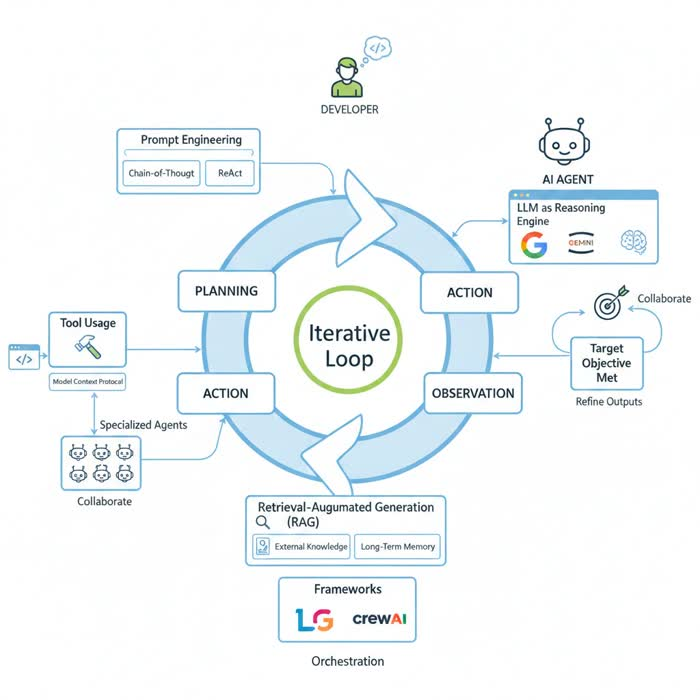
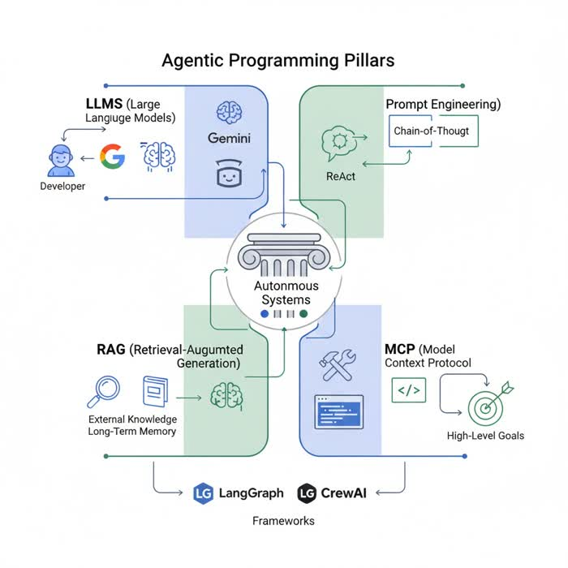

# What is Agentic Programming?

Agentic programming represents a profound shift in how we design and build software, moving beyond rigid, pre-scripted instructions to create autonomous, goal-oriented systems. At its heart, agentic programming leverages the reasoning capabilities of Large Language Models (LLMs) to enable software agents to understand high-level objectives, break them down into manageable tasks, execute actions, and learn from observations, all while striving to achieve a defined goal. This paradigm empowers developers to build intelligent applications that can adapt, self-correct, and even collaborate, mirroring aspects of human problem-solving in complex environments. It's about orchestrating intelligence, memory, and tool use to solve problems that were previously intractable for traditional deterministic code.

## The Paradigm Shift: From Scripts to Agents

Traditional software development relies on explicit, step-by-step instructions. A program is a set of rules that, when followed precisely, produces a predictable outcome. While incredibly powerful for deterministic tasks, this approach struggles with ambiguity, novelty, and dynamic environments.

Agentic programming introduces a new paradigm:
*   **Goal-Oriented:** Instead of being told *how* to do something, an agent is given a high-level *what* (a goal) and tasked with figuring out the *how*.
*   **Autonomous:** Agents operate with a degree of independence, making decisions and taking actions without constant human intervention.
*   **Adaptive:** They can learn from their experiences, adjust strategies, and self-correct when faced with unexpected outcomes.
*   **LLMs as the Brain:** LLMs serve as the core reasoning engine, interpreting goals, generating plans, and deciding on actions based on their vast knowledge and understanding of language.

This shift moves us from merely automating tasks to automating *problem-solving*, enabling software to tackle more complex, open-ended challenges.


```masteryls
{"id":"d35fd118-2ab1-44f7-bac3-502e426a335a", "title":"What is agentic programming", "type":"teaching", "body":"Can you explain to me how agentic programming differs from traditional programming?" }
```


## The Core Agentic Loop: Plan, Act, Observe



The fundamental architecture of an agentic system revolves around an iterative cycle known as the Plan, Act, Observe (PAO) loop. This loop mirrors how humans approach complex tasks:

### Planning
The agent begins by receiving a high-level goal. Its first step is to *plan*:
*   **Decomposing Tasks:** The LLM, acting as the agent's brain, breaks down the main goal into smaller, more manageable sub-tasks.
*   **Strategy Formulation:** It devises a strategy or a sequence of steps to address these sub-tasks, considering available tools and potential outcomes.
*   **Contextual Understanding:** This planning phase often involves deeply understanding the current situation, past interactions, and available resources.

For example, if the goal is "research the latest advancements in quantum computing," the planning phase might involve identifying key search terms, deciding which databases or websites to consult, and outlining the information types to extract.

### Action
Once a plan is formulated, the agent proceeds to *act*. This involves executing the planned steps using available tools.
*   **Tool Use:** Agents interact with the external world through "tools," which are essentially functions or APIs that the LLM can call. These tools can range from simple calculators, web search engines, and database queries to more complex operations like sending emails, executing code, or interacting with other software systems.
*   **Model Context Protocol:** The LLM is provided with a description of these tools (their names, purposes, and parameters) within its prompt context. This "protocol" allows the LLM to understand *when* and *how* to invoke a specific tool to achieve a part of its plan.
*   **Execution:** The agent selects the appropriate tool, formats the input based on its understanding, and executes the tool.

Continuing the quantum computing example, the agent might use a "web_search" tool with queries like "recent quantum computing breakthroughs" or "quantum machine learning applications."

### Observation
After an action is performed, the agent *observes* the outcome.
*   **Evaluating Results:** The output from the tool (e.g., search results, API response, code execution output) is fed back into the LLM. The LLM then evaluates whether the action achieved the desired effect, if the plan is still valid, or if adjustments are needed.
*   **Feedback and Self-Correction:** Based on the observation, the agent might decide to refine its plan, try a different tool, re-evaluate its strategy, or even recognize an error and attempt to correct it. This self-correction mechanism is crucial for resilience and adaptability.
*   **Iteration:** The information gained from the observation then feeds back into the planning phase, starting a new iteration of the loop until the overall goal is met or deemed unachievable.

If the initial web search yields too many irrelevant results, the agent might observe this, refine its search terms, or decide to use a more specialized academic database tool in the next action step.

## Key Pillars of Agentic Programming

Several core technologies and techniques underpin the effectiveness of agentic programming:



### Large Language Models (LLMs) as Reasoning Engines
LLMs are the brain of any agentic system. Their ability to understand natural language, generate coherent text, and perform complex reasoning tasks (like inference, summarization, and task decomposition) makes them ideal for:
*   **Goal Interpretation:** Understanding the user's high-level objective.
*   **Planning:** Devising step-by-step strategies.
*   **Decision Making:** Choosing which tools to use and how to use them.
*   **Output Generation:** Synthesizing final answers or reports.

### Prompt Engineering for Agentic Control
Effective communication with the LLM is paramount. Prompt engineering involves crafting specific instructions and contextual information to guide the LLM's behavior and reasoning process.
*   **Chain-of-Thought (CoT):** This technique encourages the LLM to break down its reasoning process into intermediate steps, much like a human thinking aloud. By instructing the LLM to "think step-by-step," it can often arrive at more accurate and robust conclusions. This is vital for the planning phase of the PAO loop.
*   **ReAct (Reasoning and Acting):** ReAct combines CoT prompting with the ability to *act* using external tools. The LLM alternates between generating a *thought* (reasoning about what to do next) and an *action* (invoking a tool). The *observation* from the tool's execution is then fed back, allowing for iterative refinement. ReAct is a direct implementation of the PAO loop within the prompt itself.

### Retrieval-Augmented Generation (RAG) for Context and Memory
LLMs have a vast but static knowledge base and a limited context window. RAG addresses these limitations by providing agents with access to external, up-to-date, and domain-specific information.
*   **External Knowledge:** Before generating a response or plan, the agent can retrieve relevant information from a knowledge base (e.g., documents, databases, web searches) using semantic search.
*   **Enhanced Context:** This retrieved information is then provided to the LLM as additional context, allowing it to generate more accurate, factual, and informed outputs, reducing hallucinations.
*   **Long-Term Memory:** RAG effectively serves as the agent's long-term memory, enabling it to recall past interactions, learned facts, or specific domain knowledge beyond its initial training data.

### Tool Use and the Model Context Protocol
Agents extend their capabilities beyond mere text generation by interacting with external systems through tools.
*   **Defining Tools:** Developers define tools as functions with clear descriptions of what they do and what parameters they accept.
*   **Providing Tools to the LLM:** These tool descriptions are injected into the LLM's context. The LLM, guided by prompt engineering techniques like ReAct, learns to "call" these tools by generating specific structured outputs (e.g., JSON) that indicate the tool name and its arguments.
*   **Execution and Observation:** An orchestrator then intercepts this call, executes the actual function, and feeds the result back to the LLM as an observation. This allows agents to perform actions like searching the web, executing Python code, calling external APIs (e.g., weather, stock prices, CRM), or interacting with databases.

```masteryls
{"id":"4027bfe7-a7cb-48ec-afc2-215f0c25b8cb", "title":"You are the AI", "type":"essay", "body":"Pretend that you are the LLM. Take the following prompt and come up with a plan to resolve it. Then create an ordered list that break the plan into intermediate steps, define actions for each step, and define what you would observe to validate the success of the actions.\n\n_Prompt_:\nI want to give bonuses to each of my employees. I want it to be fair based upon past performance, but also to server as an incentive for future effort and loyalty." }
```

## Orchestration Frameworks: Building Agentic Workflows

While the core concepts are powerful, managing complex agent interactions, state, and tool calls manually can be daunting. Frameworks simplify the creation and orchestration of agentic systems:

### LangChain
[LangChain](https://www.langchain.com/) is a package that helps you construct and manage the components of an agentic system.
* **Support for RAG**: It's a foundational tool for implementing Retrieval-Augmented Generation, allowing agents to access external knowledge.
* **Tool orchestration**: It assists in connecting LLMs with various tools, enabling agents to interact with the outside world.

Think of LangChain as a toolkit that simplifies the process of developing applications powered by LLMs, especially those involving agents, memory, and external data sources. It's often used as a base for frameworks.

### LangGraph
Built on top of LangChain, [LangGraph](https://langgraph.ai/) focuses on creating stateful, multi-actor applications with LLMs by representing the agentic workflow as a directed acyclic graph (DAG) or a state machine.
*   **State Management:** It allows defining a shared state that agents can read from and write to, enabling complex, multi-step processes where agents pass information between each other.
*   **Flexible Workflows:** Developers can define nodes (representing agents or tool calls) and edges (representing transitions based on conditions or agent outputs), creating highly customizable and dynamic workflows.
*   **Cyclical Processing:** LangGraph is particularly adept at handling cyclical patterns inherent in the Plan, Act, Observe loop, allowing an agent to return to a previous state for refinement.

### CrewAI
[CrewAI]( https://www.crewai.com/) is designed for orchestrating collaborative AI agents. It emphasizes a role-based approach, where specialized agents work together to achieve a common goal.
*   **Role-Based Agents:** Each agent is assigned a specific role (e.g., "Researcher," "Writer," "Editor"), defined with a clear backstory, goals, and specific tools.
*   **Task Delegation and Collaboration:** Agents can delegate tasks to each other, review each other's work, and collectively refine outputs. This mimics human team dynamics.
*   **Hierarchical Workflows:** It supports complex workflows where a "manager" agent might oversee the work of several "worker" agents, ensuring the overall objective is met through coordinated effort.

Both frameworks provide abstractions to manage the PAO loop, prompt engineering, tool integration, and state, significantly accelerating development.

## Practical Application: An Agentic System in Action

Let's imagine building a "Smart Content Creator" agentic system using these principles.

**Goal:** Generate a blog post about "The Future of AI in Healthcare," including recent trends and potential ethical considerations.

**CrewAI Example:**

1.  **Define Agents:**
    *   **Researcher Agent:**
        *   **Role:** Expert in AI and Healthcare, skilled in finding cutting-edge information.
        *   **Tools:** Web Search (e.g., Google Scholar, PubMed), Document Reader (for PDFs/reports).
        *   **Goal:** Gather comprehensive, up-to-date information on AI in healthcare, focusing on recent trends and ethical debates.
    *   **Writer Agent:**
        *   ****Role:** Professional content writer, skilled in engaging prose and structuring articles.
        *   **Tools:** None (primarily uses LLM for generation).
        *   **Goal:** Draft a well-structured and engaging blog post based on the researcher's findings.
    *   **Editor Agent:**
        *   **Role:** Experienced editor, meticulous about clarity, grammar, and factual accuracy.
        *   **Tools:** None (primarily uses LLM for review).
        *   **Goal:** Review and refine the blog post for quality, coherence, and factual correctness.

2.  **Define Tasks and Workflow:**
    *   **Task 1 (Researcher):** "Find 5-7 key recent advancements of AI in healthcare and 3-4 prominent ethical concerns."
        *   *PAO Loop in Researcher:*
            *   *Plan:* Break down into sub-searches (e"AI in healthcare recent trends," "ethics of AI in medicine").
            *   *Act:* Use "web_search" tool, parse results.
            *   *Observe:* Evaluate relevance, summarize findings. Iterate if information is insufficient.
            *   *Output:* A structured summary of findings.
    *   **Task 2 (Writer):** "Draft a blog post combining the research findings, structured with an introduction, sections for advancements, ethics, and a conclusion."
        *   *PAO Loop in Writer:*
            *   *Plan:* Outline blog post structure.
            *   *Act:* Generate text for each section, integrating researcher's output.
            *   *Observe:* Review generated text for coherence, completeness against the plan. Self-correct if needed.
            *   *Output:* A first draft of the blog post.
    *   **Task 3 (Editor):** "Review the draft for clarity, grammar, factual accuracy, and overall tone. Suggest improvements."
        *   *PAO Loop in Editor:*
            *   *Plan:* Identify areas for review (intro, body paragraphs, conclusion, grammar).
            *   *Act:* Analyze the blog post section by section, comparing facts against a general understanding (or even using a "fact_check" tool if available).
            *   *Observe:* Identify errors, suggest rewrites.
            *   *Output:* A refined blog post with suggested edits or a final version.

This collaborative approach allows each agent to specialize, leveraging its specific role and tools, with the overall system iterating until a high-quality blog post is produced.

## Common Challenges and Solutions in Agentic Development

While powerful, agentic programming presents its own set of challenges:

1.  **Hallucinations and Reliability:** LLMs can sometimes generate incorrect or fabricated information, impacting the agent's reliability.
    *   **Solution:** Implement robust RAG to ground responses in factual data. Use prompt engineering techniques (e.g., "think step-by-step," "cite sources") to encourage careful reasoning. Incorporate validation steps where an agent cross-references information or a separate "validator" agent checks facts.

2.  **Cost and Latency:** Frequent LLM calls, especially for complex reasoning or multiple iterations of the PAO loop, can lead to high costs and slow response times.
    *   **Solution:** Optimize prompt length. Use smaller, faster models for simpler tasks and larger models only when necessary. Implement caching for frequently accessed information or common LLM outputs. Design workflows to minimize unnecessary LLM calls. Consider asynchronous execution for parallel tasks.

3.  **Debugging Complexity:** The non-deterministic nature of LLMs makes debugging agentic systems challenging. It's hard to trace why an agent made a particular decision or took an unexpected action.
    *   **Solution:** Implement comprehensive logging of all LLM inputs (prompts), outputs (thoughts, actions), and tool observations. Use visualization tools (e.g., those provided by LangGraph or custom dashboards) to trace agent execution paths. Employ iterative testing with clear test cases to pinpoint issues.

4.  **Managing State and Context:** Keeping track of relevant information across multiple turns or complex workflows, especially with LLM context window limitations, can be difficult.
    *   **Solution:** Use effective RAG for long-term memory. Implement structured state management within frameworks like LangGraph. Summarize past interactions or observations to fit within the LLM's context window, providing only the most relevant information for the current decision.

5.  **Security and Safety:** Agents interacting with external tools or sensitive data pose security risks. Malicious inputs or unintended actions can have real-world consequences.
    *   **Solution:** Implement strict input validation and sanitization for all user inputs and tool outputs. Use guardrails and moderation APIs to filter harmful content or actions. Implement "human-in-the-loop" mechanisms for critical decisions or before executing destructive actions. Restrict tool access to only what's absolutely necessary (principle of least privilege).

## Summary

Agentic programming marks a significant evolution in software development, enabling the creation of autonomous, goal-driven systems powered by Large Language Models. Its core, the Plan, Act, Observe loop, allows agents to iteratively break down goals, execute actions using specialized tools, and learn from their environment. Key components like sophisticated prompt engineering (Chain-of-Thought, ReAct), Retrieval-Augmented Generation (RAG) for external knowledge, and robust tool integration are crucial for their effectiveness. Frameworks like LangGraph and CrewAI provide the necessary scaffolding to orchestrate complex multi-agent workflows. While challenges such as reliability, cost, and debugging exist, ongoing research and best practices offer viable solutions, paving the way for increasingly intelligent and adaptive software applications that can tackle real-world problems with unprecedented autonomy.

## Further Exploration

*   **[ReAct Paper](https://arxiv.org/abs/2210.03629):** Explore the original "ReAct: Synergizing Reasoning and Acting in Language Models" paper to understand the foundational prompting technique.
*   **LangChain & [LlamaIndex Documentation](https://www.llamaindex.ai/):** Dive into the official documentation for these libraries, which provide the building blocks for RAG, tool orchestration, and agent creation.
*   **LangGraph & CrewAI Documentation:** Experiment with these frameworks to build your first multi-agent systems and understand their architectural patterns.
*   **AI Agent Communities:** Engage with online communities and forums dedicated to AI agents to stay updated on the latest advancements and share insights.
*   **[AutoGen](https://microsoft.github.io/autogen/)**: A framework by Microsoft for building LLM applications that feature multiple agents capable of conversing with each other to accomplish complex tasks, showcasing collaborative intelligence in agentic systems.
*   **[OpenAI](https://platform.openai.com) API**: Provides access to advanced LLMs like GPT-4, which serve as the foundational intelligence for agentic reasoning, decision-making, and natural language understanding.
*   **[Anthropic](https://www.anthropic.com) API**: Offers access to Claude models, another leading family of LLMs known for their strong reasoning and safety features, used to power intelligent agents.
*   **[Google](https://ai.google.dev) AI (Gemini API)**: Provides access to Google's Gemini family of LLMs, enabling agents with powerful multimodal capabilities (text, image, audio, video) for more diverse and sophisticated interactions.
*   **[Pinecone](https://www.pinecone.io/)**: A leading vector database designed for high-performance similarity search, critical for agents requiring efficient retrieval of context from large knowledge bases (e.g., for RAG) to inform their actions and responses.
*   **[Weaviate](https://weaviate.io)**: An open-source vector database that allows storing data objects and vector embeddings for semantic search, crucial for agents to remember past interactions, retrieve relevant information, and maintain long-term memory.
*   **[Qdrant](https://qdrant.tech)**: A vector similarity search engine and database, providing fast and scalable solutions for embedding-based search, vital for implementing effective RAG mechanisms within agentic systems.
*   **[Chroma](https://www.trychroma.com)**: An open-source embedding database, often used for local development and smaller-scale agentic memory requirements, providing a straightforward way to store and query embeddings.
